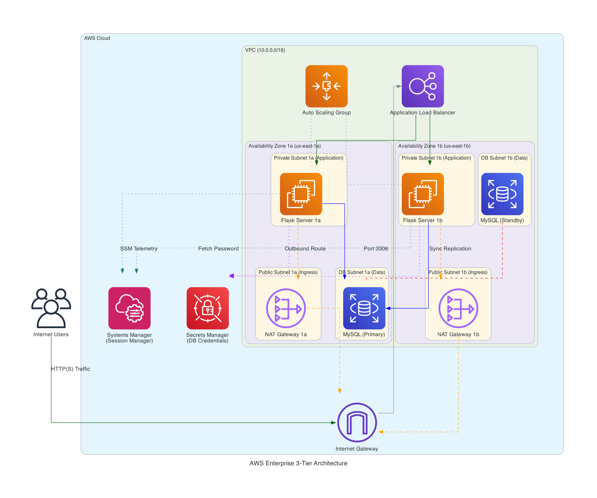

# AWS 3-Tier Web Architecture with Terraform: A Learning Project

## Overview

This project is a record of my learning journey into AWS cloud infrastructure. My goal was to move beyond clicking around the AWS Management Console and learn how to build a secure, highly available, and scalable environment entirely from scratch using Terraform (Infrastructure as Code).

## Demo

## The Architecture

The infrastructure spans two Availability Zones for high availability and is divided into three distinct network tiers:

1. **Presentation Tier (Public Subnets):** Contains the Application Load Balancer (ALB) and NAT Gateways. This is the only part of the network exposed to the internet.
2. **Application Tier (Private Subnets):** Contains an Auto Scaling Group of EC2 instances running a custom Python Flask application. These servers have no public IP addresses.
3. **Data Tier (DB Subnets):** Contains a Multi-AZ Amazon RDS MySQL database. This tier is strictly isolated and stores the persistent data.

## Tech Stack Used

- **Infrastructure as Code:** Terraform
- **Compute:** Amazon EC2, Auto Scaling Groups (ASG), Launch Templates
- **Networking:** VPC, Public/Private Subnets, Internet Gateway, NAT Gateways, Route Tables, Application Load Balancer (ALB)
- **Database:** Amazon RDS (MySQL)
- **Security:** IAM Roles, Instance Profiles, Security Group Chaining, AWS Secrets Manager
- **Application:** Python, Flask, PyMySQL, Boto3, Systemd

## Key Learnings

- **Security Group Chaining:** Instead of allowing IP addresses, I configured the EC2 instances to only accept traffic from the ALB's Security Group ID. The database only accepts traffic from the EC2 Security Group ID. This makes it mathematically impossible to bypass the load balancer.
- **Secrets Management:** I learned that hardcoding database passwords in startup scripts is a security risk. I used Terraform to generate a random password, stored it in AWS Secrets Manager, and gave the EC2 instances an IAM Role to fetch the password dynamically at runtime using the Boto3 SDK.
- **SSM over SSH:** I did not open Port 22 or use SSH key pairs. To access my private instances for debugging, I attached the AmazonSSMManagedInstanceCore policy and used AWS Systems Manager (Session Manager) to get a secure terminal.
- **Automated Scaling:** I moved from static server counts to elasticity by attaching a CloudWatch Target Tracking Policy to the ASG.

## Challenges and Gotchas

- **Launch Template Updates:** I learned that running `terraform apply` after updating a user_data script does not update existing servers. I had to implement an `instance_refresh` block in the ASG to perform automated rolling updates.
- **The Cost of High Availability:** I learned that enterprise architecture costs money. Adding a second NAT Gateway and turning on RDS Multi-AZ doubles the baseline cost, teaching me how to weigh budget against uptime.
- **Security Group Rule Conflicts:** I learned the hard way never to mix inline security group rules (inside the main resource) with standalone rule resources. Doing so creates a conflict where Terraform constantly thinks the infrastructure has drifted and tries to delete the standalone rules on the next run.
- **RDS Subnet Group Requirements:** I realized you cannot just deploy a managed database into a single private subnet. AWS actively enforces high availability by making you create a DB Subnet Group that spans at least two Availability Zones before it even allows the RDS instance to provision.

## How to Deploy

If you want to run this code:

1. Configure your AWS credentials locally.
2. Run `terraform init` to download the AWS provider.
3. Run `terraform plan` to see the resources that will be created.
4. Run `terraform apply` to provision the infrastructure. (Note: RDS creation takes about 10-15 minutes).
5. Once complete, Terraform will output the ALB DNS name. Wait a few minutes for the EC2 instances to boot and pass health checks, then visit the URL in your browser.

**Important Note on Cost:** This architecture uses managed services (NAT Gateways, ALB, RDS) that incur hourly charges. Always run `terraform destroy` when you are done learning to prevent unexpected AWS bills.
